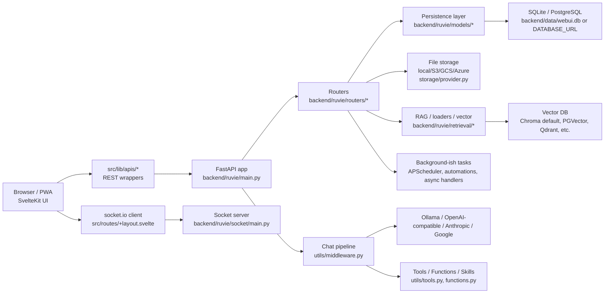

# Architecture

## So do tong quan

## Runtime layers

- Frontend: SvelteKit/Vite app in `src/`. Routes live in `src/routes`, reusable UI in `src/lib/components`, stores in `src/lib/stores/index.ts`, REST clients in `src/lib/apis/*`.
- Backend: FastAPI app in `backend/ruvie/main.py`. It mounts `/ws`, includes all `/api/v1/*` routers, exposes OpenAI-compatible routes such as `/api/chat/completions`, serves static/frontend assets, and health endpoints `/health`, `/ready`, `/health/db`.
- Database: SQLAlchemy sync + async engines in `backend/ruvie/internal/db.py`. Default DB URL is SQLite under `DATA_DIR/webui.db` from `backend/ruvie/env.py`; PostgreSQL is supported by `DATABASE_URL`.
- Storage: `backend/ruvie/storage/provider.py` abstracts local upload storage plus S3, Google Cloud Storage, and Azure Blob. Upload directory is configured in `backend/ruvie/config.py`.
- RAG/vector: `backend/ruvie/retrieval/*` handles document loaders, web loaders, embeddings, rerankers, and vector DB adapters. Default `VECTOR_DB` is `chroma` in `backend/ruvie/config.py`.
- Realtime: `backend/ruvie/socket/main.py` is mounted at `/ws`; frontend connects in `src/routes/+layout.svelte`.
- Scripts/build: frontend scripts in `package.json`; backend packaging/deps in `pyproject.toml`; startup scripts in `backend/start.sh`, `backend/start_windows.bat`, `backend/dev.sh`; Pyodide asset preparation in `scripts/prepare-pyodide.js`.

## Module va thu muc chinh

| Path | Trach nhiem |
|---|---|
| `src/routes/+layout.svelte` | App shell, i18n, socket, theme/config/user bootstrap, pyodide worker. |
| `src/routes/(app)/+layout.svelte` | Authenticated layout; loads settings, models, tools, banners, terminals; handles pending users. |
| `src/routes/(app)/+page.svelte` | Main app route; renders chat. |
| `src/lib/components/chat/Chat.svelte` | Core chat state machine: selected models, message history, queue, files, submit/regenerate/share flows. |
| `src/lib/components/chat/MessageInput.svelte` | Prompt input, file upload/attach flows, commands, model/tool/knowledge insert UX. |
| `src/lib/apis/*` | Typed-ish frontend wrappers over backend REST endpoints. |
| `backend/ruvie/main.py` | Backend entry point, app lifecycle, router mounting, chat completion endpoint, static serving, health checks. |
| `backend/ruvie/routers/*` | HTTP API grouped by domain: auths, users, chats, files, knowledge, models, tools, functions, channels, calendar, automations, etc. |
| `backend/ruvie/models/*` | SQLAlchemy models and table repositories. Most files expose singleton repositories such as `Users`, `Chats`, `Files`, `Models`. |
| `backend/ruvie/utils/middleware.py` | Main chat processing pipeline: payload transformation, files/RAG/tools/functions, streaming response handling. |
| `backend/ruvie/retrieval/*` | RAG loaders, web search providers, vector DB adapters, embedding/reranking helpers. |
| `backend/ruvie/config.py` | Runtime config values and default config persisted to DB. |
| `backend/ruvie/env.py` | Env parsing, paths, DB URL, auth secret validation, Redis/websocket config. |
| `backend/ruvie/socket/*` | Realtime socket rooms/events for chat/channel/user activity. |

## Dong du lieu chat chinh

1. User nhap prompt trong `src/lib/components/chat/MessageInput.svelte`.
2. `src/lib/components/chat/Chat.svelte` gom history bang `createMessagesList`, quan ly `selectedModels`, `files`, `chatFiles`, queue va goi submit.
3. Neu chat moi, frontend tao record qua `src/lib/apis/chats/index.ts` -> `backend/ruvie/routers/chats.py`.
4. Completion request den `/api/chat/completions` trong `backend/ruvie/main.py`.
5. `main.py` lay user/model/metadata, goi `process_chat_payload` trong `backend/ruvie/utils/middleware.py`.
6. Middleware nap folder/knowledge/files, xu ly image/file context, tools/functions/filters, permissions, model params.
7. Backend forward sang provider (`backend/ruvie/routers/openai.py`, `ollama.py`, provider clients/config) hoac pipeline tuong ung.
8. `process_chat_response` xu ly streaming chunks, tool call results, files/citations/events; socket/task events cap nhat frontend khi can.
9. Chat/message/file metadata duoc luu qua `backend/ruvie/models/chats.py`, `chat_messages.py`, `files.py`.

## Assumptions / Unknowns

- Khong co worker process rieng theo kieu queue system doc lap trong repo. Automations dung APScheduler/task logic trong Python app; mot so handler la async/background handler trong request lifecycle.
- Docker va production deploy co nhieu compose variants, nhung tai lieu nay tap trung vao source architecture, khong phan tich tung compose file.
- `backend/ruvie/utils/middleware.py` la module rat lon va chua tach domain ro; architecture hien tai gan nhieu chat pipeline concern vao mot file.
